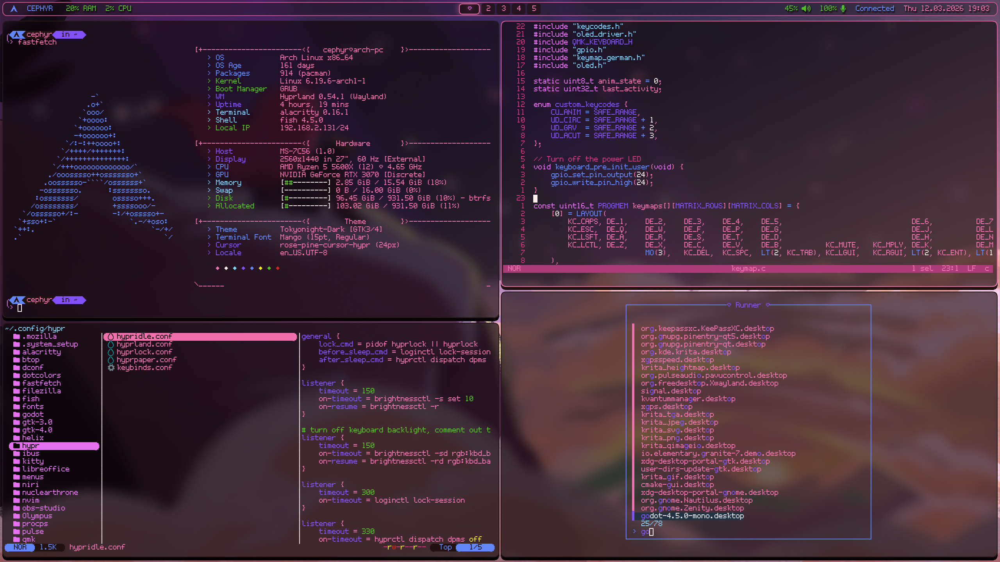
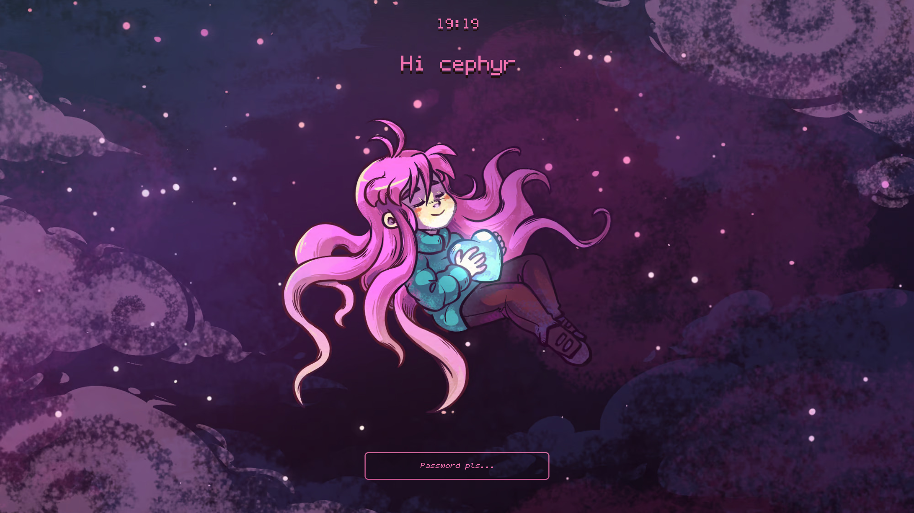

# Personal Arch setup
My minimal, ergonomic setup for everyday use.

**Warning!** This is a personal project, I might make undocumented breaking changes at any time and offer no support.

I have moved to NixOS now, my config can be found [here](https://github.com/cephyr-games/nixos-config).

This repository will stay up, in case it is useful to anyone or I need to switch back.

Using:
- `Arch Linux` operating system
- `Hyprland` Wayland compositor
- `Waybar` status bar
- `Hyprlock` lockscreen
- `Alacritty` terminal emulator
- `Fish` shell
- `Helix` text editor
- `Yazi` file manager
- `Fzf` launcher

## Keybinds
A lot of keybinds are positional and designed to make sense with a Colemak layout,
specifically my [custom keymap](https://github.com/cephyr-games/cephyr-keyboards) for my Aurora Sofle keyboard.
A full list of system keybinds can be found [here](.config/hypr/keybinds.conf).
Programs that use vim motions (that's most of them) have been rebound to work with Colemak.

## Wallpapers
Desktop and Lockscreen use artworks by Amora Bettany from the game *Celeste*,
freely availble on the artists page [here](https://amora.ink/).

## Colorscheme
All programs have `@@color_name@@` annotations in their configs for automatic switching with [dotcolors](https://github.com/Atrejooo/dotcolors).

## Acknowledgement
A lot of configuration has been copied and modified from [these dotfiles](https://github.com/Atrejooo/arch_dotfiles/tree/main).
